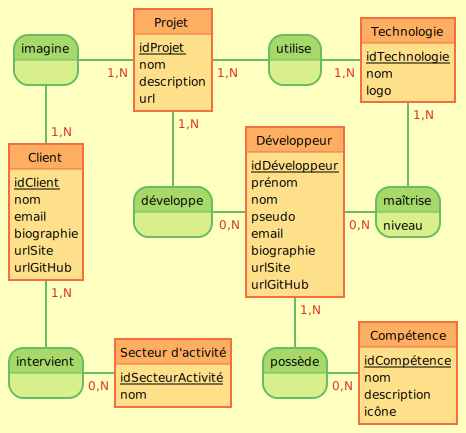
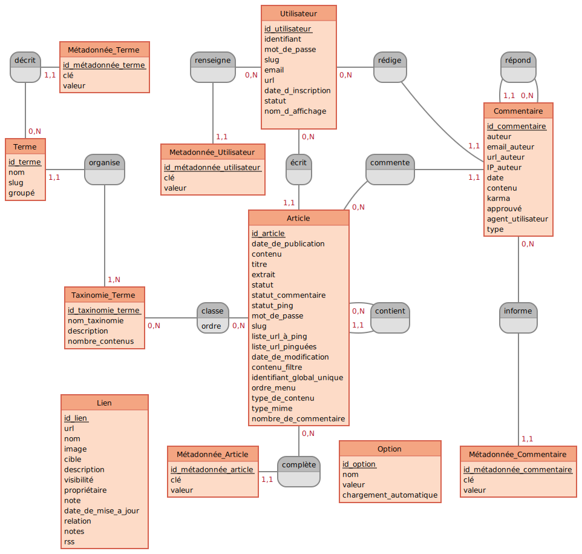
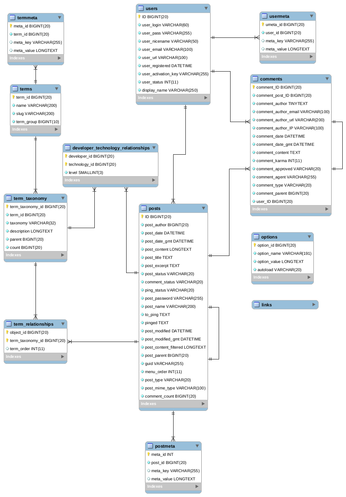

# Gestion des données avec WordPress

## Modèle conceptuel de données (MCD)

### oProfile

### WordPress

[Voir le diagramme EER MySQL](wordpress-eer.png)

---

## Entités

Nom|Table WordPress|Détail(s)
-|-|-
Client|`users`|role `client`
Client|`posts`|type `client` pour la page profil visible sur le site
Développeur|`users`|role `developer`
Développeur|`posts`|type `developer` pour la page profil visible sur le site
Projet|`posts`|type `project`
Compétence|`terms`| taxonomy `skill`
Secteur d'activité|`terms`|taxonomy `activity_area`
Technologie|`terms`|taxonomy `technology`

---

## Propriétés (Attributs)

### Client

Propriété|Table WordPress|Colonne|Détail(s)
-|-|-|-
idClient|`users`|`ID`|
nom|`usermeta`|`meta_value`|`meta_key` = `company_name`
email|`users`|`user_email`|
biographie|`usermeta`|`meta_value`|`meta_key` = `description`
urlSite|`user`|`user_url`|
urlGitHub|`usermeta`|`meta_value`|`meta_key` =  `github_url`

### Compétence

Propriété|Table WordPress|Colonne|Détail(s)
-|-|-|-
idCompétence|`terms`|`term_id`|
nom|`terms`|`name`|
description|`term_taxonomy`|`description`|
icône|`termmeta`|`meta_value`|`meta_key` = `icon`

### Développeur

Propriété|Table WordPress|Colonne|Détail(s)
-|-|-|-
idDéveloppeur|`users`|`ID`|
prénom|`usermeta`|`meta_value`|`meta_key` = `first_name`
nom|`usermeta`|`meta_value`|`meta_key` = `last_name`
pseudo|`usermeta`|`nickname`|
email|`users`|`user_email`|
biographie|`usermeta`|`meta_value`|`meta_key` = `description`
urlSite|`user`|`user_url`|
urlGitHub|`usermeta`|`meta_value`|`meta_key` = `github_url`

### Projet

Propriété|Table WordPress|Colonne|Détail(s)
-|-|-|-
idProjet|`posts`|`ID`|
nom|`posts`|`post_title`
description|`posts`|`post_content`
url|`postmeta`|`meta_value`|`meta_key` = `url`

### Secteur d'activité

Propriété|Table WordPress|Colonne|Détail(s)
-|-|-|-
idSecteurActivite|`terms`|`term_id`|
nom|`terms`|`name`|

### Technologie

Propriété|Table WordPress|Colonne|Détail(s)
-|-|-|-
idTechnologie|`terms`|`term_id`|
nom|`terms`|`name`|
logo|`termmeta`|`meta_value`|`meta_key` = `logo`

---

## Associations

Entité 1|Nom|Entité 2|Table WordPress|Colonne entité 1|Colonne entité 2|Détail(s)
-|-|-|-|-|-|-
Client|invervient|Secteur d'activité|`term_relationships`|`object_id`|`term_taxonomy_id`|
Client|imagine|Projet|`posts`|`ID`|`post_author`|S'il crée le projet
Client|imagine|Projet|`postmeta`|`object_id`|`meta_value`|`meta_key` = `client_id`
Développeur|développe|Projet|`posts`|`ID`|`post_author`|S'il crée le projet
Développeur|développe|Projet|`postmeta`|`object_id`|`meta_value`|`meta_key` = `developer_id`
Développeur|maîtrise|Technologie|`developer_technology_relationships`|`developer_id`|`technology_id`|**Table personnalisée**
Développeur|possède|Compétence|`term_relationships`|`object_id`|`term_taxonomy_id`|
Projet|utilise|Technologie|`term_relationships`|`object_id`|`term_taxonomy_id`|

Si le client crée un projet, il en sera l'auteur. Les développeurs associés au projet seront dans la table `postmeta` avec la `meta_key` `developer_id`.
Si le développeur crée un projet, il en sera l'auteur. Les clients associés au projet seront dans la table `postmeta` avec la `meta_key` `client_id`.

---

## Propriétés (Attributs) d'association

Entité 1|Nom|Entité 2|Table|Colonne|Détail(s)
-|-|-|-|-|-
Développeur|maîtrise|Technologie|`developer_technology_relationships`|`level`|Valeurs possibles : Débutant, Confirmé, Expert

[Voir le diagramme EER d'oProfile](oprofile-eer.png)
